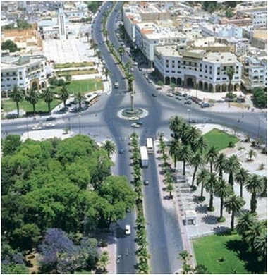

# Introduction

{:width="500px" }
*Ville de Settat*

La ville de Settat est devenue un centre administratif au début du xviiie siècle, en raison de sa position stratégique en tant que passage incontournable entre le Sud et le Nord. Grâce à la richesse du sol, elle a prospéré et constitué durant les xviiie et xixe siècles un important centre de négoce des produits agricoles, attirant des populations fort entreprenantes. Ce fut le cas des Marocains de confession juive qui s'y installèrent en masse au xixe siècle, construisant leur propre quartier, le Mellah, aux abords de la kasbah.

<!-- new slide -->
