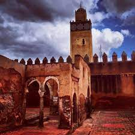

# Présentation

{:width="500px" }
*Settat*

<!-- note -->
Settat (en arabe : سطات ; en berbère : ⵙⵟⴰⵜ) est une ville du Maroc située dans la région Casablanca-Settat, chef-lieu de la province de Settat .

Cette dernière est située dans la région géographique et historique de la Chaouia, sur les terres des tribus des Ayt Settat et Mzamza (une des douze tribus de la Chaouia) à 57 km de Casablanca, sur la route de Marrakech. En 2014, sa population était de 141 703 habitants.

La tribu des Ayt Settat avait été établie par les Almohades. Ils appartenaient à l'alliance almohade dirigée par Masmuda selon al-Baydaq, Ibn Hazm et Ibn Khaldun. Leur origine est au sud-est du Haut-Atlas et ils se sont apparemment installés dans la région de la Chaouia à la suite de l'avancée des Almohades vers le nord1. On pense qu’il y avait été installé au même titre que d’autres tribus pour combattre les Berghouata, avant par finir d’être absorber par le cocon primitif de la région.

<!-- new slide -->
