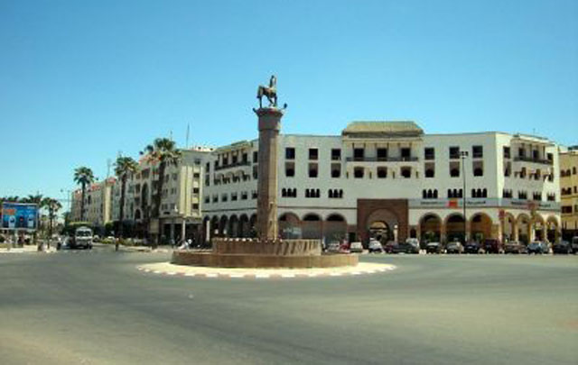

# Conclusion

{:width="500px" }
*Settat*
<!-- note -->

Les familles anciennes de Settat sont un groupe social à identité propre, composé de familles y ayant résidé depuis plusieurs siècles. Parmi ces grandes familles, la famille Abourezq, puissante lignée caïdale, qui a gouverné toute la Chaouia par le biais de El Maâti Ben Lekbir et la ville de Settat depuis le xviiie siècle, ainsi que la famille Bejjaji qui s'est consacré au commerce interne de la ville.
