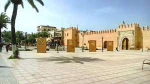

# Histoire
{:width="500px" }
*Kasbah de Settat*

<!-- note -->

En choisissant de construire la Kasbah sur le site vallonné de Settat, Moulay Ismaïl allait déclencher le processus d'urbanisation de ce site. En effet, l'édification de la kasbah a apporté ordre et sécurité aussi bien aux voyageurs qu'aux habitants et favorisé les implantations humaines à ses abords. Bien plus, en y installant le premier caïd de cette région qui dépendait auparavant de Caïd Doukkali et Rahmani, Moulay Ismaïl officialisa Settat comme chef-lieu de cette région.

La ville de Settat est devenue un centre administratif au début du xviiie siècle, en raison de sa position stratégique en tant que passage incontournable entre le Sud et le Nord. Grâce à la richesse du sol, elle a prospéré et constitué durant les xviiie et xixe siècles un important centre de négoce des produits agricoles, attirant des populations fort entreprenantes. Ce fut le cas des Marocains de confession juive qui s'y installèrent en masse au xixe siècle, construisant leur propre quartier, le Mellah, aux abords de la kasbah.

<!-- new slide -->
